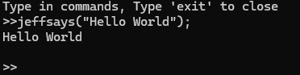

# The Jeff Programing Language (Interpreted)

Welcome to the Jeff programing language. This language was created based on the book [Writing an Interpreter in Go](https://interpreterbook.com/)


### Download

To download and use the JPL, simply visit the [releases](https://github.com/SabsTheGrumpy/Jeff-Interpreted/releases) and select the correct release package for your local machine.

For example, at the time of writing the latest release is 1.0.0. So for my windows machine running an x64 processor I would download the *1-0-0-windows-amd64.zip*

In that zip contains the jeff.exe that can be run via the command line with 

```
./jeff.exe
```

### Writing your own "Hello World"

The best place to start when learning JPL is where we always start. With a Hello World.

Hello World in JPL is very simple; first lets start the REPL via just running `jeff`


To print in JPL we use the function `jeffsays()`, so in the REPL we write

```
jeffsays("Hello World");
```

and bam. Your first JPL code is written





### Syntax

#### Variables

JPL currently only supports integer and string type variables. To declare
variables use the `jeff's` keyword preceding the variable name and the `is` 
keyword to assign the value.

```
jeff's brain is "small";
jeff's iq is 1;
```

Here we assign 2 variables; brain and iq with the values "small" and 1 respectivly

Printing these variables will show their values

```
>>jeffsays(brain);
small
```


#### Booleans/If Statements

JPL supports the True/False booleans but they are labeled right/huang;

Writing a boolean statement in the REPL shows these values

```
>>2 == 2
right
>>2 == 1
huang
```

If statements take boolean expressions as well

```
>>if (2 == 2) { return "yes" } else { return "no" }
yes
>>if (right) { return "yes" } else { return "no" }
yes
>>if (huang) { return "yes" } else { return "no" }
no
```

All non null values (except huang) are considered truthy

```
>>if (1) { return "yes" } else { return "no" }
yes
>>if ("hello world") { return "yes" } else { return "no" }
yes
```


The results of if statements can also be used in variable declarations

```
>>jeff's hair is if (right) { return "ugly"; } else { return "not ugly"; }
>>jeffsays(hair)
ugly

```

Semicolon's and return statements are optional and if statements return the last evaluated result
if no return statement is specified

```
>>if (right) { 2 + 2 }
4
```

#### Functions
Functions in JPL are declared similar to variables but with the added `fn` keyword

```
>>jeff's add is fn(x, y) { return x + y}
>>add(2, 2)
4
```

Functions can be run as expressions by pasing the arguements at the end

```
>>fn(x, y) { x + y }(1,2)
3
```

Functions can also be used as parameters to other functions

```
>>jeff's runFunc is fn(x, y, someFunc) { return x + someFunc(x,y) }
>>runFunc(2, 2, fn(a,b) { a + b })
6
```

In the above we create a function called *runFunc* that takes in 3 arguements; x, y, and someFunc

*runFunc* then calls someFunc and adds x to the result

So in the exampe we call *runFunc* with 2, 2 as x, y. 
For *someFunc* we pass in a function literal that takes 2 params (called a, b) and return a + b

So when *runFunc* is called with 2,2 is then calls the func literal we pass in; adding 2 + 2 returning 4

*runFunc* then adds x (2) to the result of *someFunc* (4) with the end value of 6


### Using .jeff files
On top of the REPL, JPL can also be run using .jeff files. Simply create a yourfile.jeff file in your favorite text editor. Then run that file passing it as an argument to the JPL.

So for a windows installation of Jeff


```
jeff.exe yourfile.jeff
```


.jeff files can have any name but must end in .jeff for the interpreter to read them

### Compiling the project

You can additionally download the source and compile the JPL yourself. JPL is written in Go. The latest version of JPL is written in 1.22.2;

So with a compatible Go installation

1. Clone this repo
2. Navigate to the project
3. Run `go build -o jeff`


### How the Interpreter Works

1. [The Lexer](lexer/README.md)
2. [The Parser](parser/README.md)
3. [The Evaluator](evaluator/README.md)
